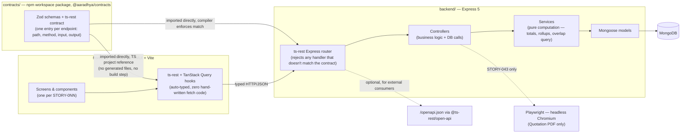

# Aaradhya — Technical Architecture & REST Codegen Setup

**Confirmed stack:** TypeScript, React, MUI, MongoDB, REST (not GraphQL). Builds on the `backend/`/`frontend/` split and story backlog from Prompts 4–5. Library versions below were checked live against the npm registry — treat them as "current as of today," re-check before pinning if you're reading this more than a few weeks after it was written.

---

## 1. Architecture overview



The one piece this diagram is making a point of: there is no arrow labeled "codegen" anywhere in it. The contract package is TypeScript that both apps import at compile time through the workspace, not a spec file that gets *turned into* TypeScript by a separate generation step. That's the outcome of the comparison in §2 — worth reading before treating this diagram as settled, since it's the opposite shape from the more common OpenAPI-first setup.

---

## 2. Codegen approach — compared, not assumed

### Option A: OpenAPI-spec-first

The backend either hand-writes an OpenAPI 3.1 spec or generates one from its Zod validation schemas (via `@asteasolutions/zod-to-openapi`). `openapi-typescript` then generates a `.d.ts` file of request/response types from that spec, which the frontend imports; a thin fetch wrapper (or `openapi-fetch`) supplies the actual typed client. This is the industry-default pattern and has the largest ecosystem — Swagger UI, Postman import, client generation for other languages, all come free once a real spec exists.

Its cost is a literal extra step: the spec (or the code it's generated from) changes, and someone has to re-run the generator before the frontend's types catch up. Nothing enforces that at compile time — a stale generated file just silently has the wrong shape until someone notices a runtime mismatch or remembers to regenerate. For a team running Prompt 5's story loop, where an endpoint (e.g. STORY-019) and the screen that consumes it (STORY-020) are frequently built in separate sessions, days apart, that's exactly the gap where drift creeps in.

### Option B: ts-rest — TypeScript-first contract, no generation step

A single `contracts/` package defines each endpoint's path, method, and Zod input/output schemas as a plain TypeScript object — the "contract." The backend's `@ts-rest/express` router takes that contract and a matching implementation object; if a handler's return shape doesn't match the contract, it's a **TypeScript compile error**, not a runtime surprise. The frontend imports the same contract into `@ts-rest/react-query`, which hands back fully-typed, ready-to-use React Query hooks — `useQuery`/`useMutation` with correct input/output types, generated at the type level, nothing written to disk.

The real endpoints are still real REST — correct verbs, correct paths, correct status codes — so this isn't the tRPC-style RPC-over-HTTP pattern the prompt used as its other example; it keeps the "REST API, not GraphQL, not RPC" decision already locked in Prompt 2 intact. If an external consumer or a Swagger UI is ever needed, `@ts-rest/open-api` derives an OpenAPI document from the same contract on request — so Option B doesn't foreclose Option A's ecosystem, it just doesn't pay Option A's sync cost by default.

### Comparison

| | OpenAPI-spec-first | ts-rest contract-first |
|---|---|---|
| Source of truth | The spec (hand-written or generated from code) | A TS object both apps import directly |
| Frontend↔backend sync | Manual — re-run `openapi-typescript` after any backend change | Automatic — same import, same compiler pass |
| Drift when someone forgets a step | Silent until a runtime mismatch is noticed | Impossible — won't compile |
| External API consumers / Swagger UI | First-class, native | Available via `@ts-rest/open-api`, generated from the same contract |
| Ecosystem size | Very large (framework/language-agnostic) | Smaller, TS-only |
| Fit for a single-repo, single-team, no-external-consumer app | Works, but pays a sync tax for no benefit yet | Direct fit |

### Decision: ts-rest

Aaradhya has no external API consumers in v1 scope (SRS §7 explicitly excludes a client portal, payment gateway integration, and third-party access), both apps already live in one npm-workspaces repo (Prompt 5), and the team's actual failure mode to guard against is exactly the one ts-rest removes by construction: an endpoint story and its consuming UI story built in separate Claude Code sessions quietly drifting apart. If Aaradhya ever needs to expose its API externally, `@ts-rest/open-api` produces the OpenAPI document from the exact same contract already in place — that's a later addition, not a rewrite.

---

## 3. Amendment to Prompt 5's folder structure

Prompt 5's tree listed `frontend/src/generated/` as "output of the Prompt 6 codegen step, never hand-edited." With ts-rest chosen, there's no generated-file step to populate that folder — replace it with a new workspace package instead:

```
aaradhya-event-management/
├── contracts/                          # NEW — @aaradhya/contracts
│   ├── package.json
│   ├── src/
│   │   ├── schemas/                    # Zod schemas — Event, Session, Item, User, etc.
│   │   │   └── (one file per entity, matching the Glossary in the SRS)
│   │   ├── routes/                     # one file per module (events.ts, sessions.ts, auth.ts, ...)
│   │   └── index.ts                    # exports the combined ts-rest contract
│   └── tsconfig.json
│
├── backend/
│   ├── src/
│   │   ├── router.ts                   # NEW — @ts-rest/express router wired to the contract
│   │   └── ...                         # models/, controllers/, services/, middleware/, validations/ unchanged from Prompt 5
│
├── frontend/
│   ├── src/
│   │   ├── api/
│   │   │   └── client.ts               # NEW — @ts-rest/react-query client built from the contract
│   │   └── ...                         # components/, pages/, theme/, stores/ unchanged from Prompt 5
│   │                                    # (src/generated/ removed — superseded by contracts/)
```

`backend/src/validations/` (already in Prompt 5's tree) now holds only validation that's genuinely request-specific and not already expressed in the shared contract schema — most of what would have lived there moves into `contracts/src/schemas/`, since those Zod schemas are now the single definition ts-rest validates both the request against and the TypeScript types from.

---

## 4. Library table

| Library | Version (checked today) | Purpose | Why this one |
|---|---|---|---|
| Node.js | 24.x LTS | Runtime | Current LTS line — Current (26.x) moves faster than an internal business tool needs; LTS gets security patches on a predictable schedule. |
| TypeScript | latest 5.x | Language | Already the confirmed stack; strict mode on from day one. |
| Zod | `^4.4.3` | Schema definition + validation, shared by contracts, backend request validation, and frontend forms | One validation library end-to-end — the same schema that defines a contract's input also drives `react-hook-form`'s resolver, so validation logic is never duplicated between client and server. Confirm `ts-rest@3.52.x`'s declared Zod peer range at install time before assuming v4 is accepted without a warning. |
| ts-rest (`@ts-rest/core`, `@ts-rest/express`, `@ts-rest/react-query`, `@ts-rest/open-api`) | `^3.52.1` (all four in lockstep) | The contract layer — see §2 | Removes the codegen sync-drift failure mode by construction; keeps real REST semantics; can still emit OpenAPI later without switching libraries. |
| Express | `^5.2.1` | HTTP server | Express 5 is the current stable major (native promise/async error handling, no more manual try/catch-per-route); by far the most common Node HTTP framework, which matters directly for Claude Code's output quality — more training exposure means more reliable scaffolding. |
| Mongoose | `^9.9.2` | MongoDB ODM | Schema-level modeling for the embedded Event→Sessions→Items structure the SRS describes; actively maintained, current major. |
| MongoDB | latest stable server | Database | Already the confirmed stack. |
| `jose` | `^6.2.10` | JWT signing/verification for auth (STORY-002/003) | Modern, ESM-first, actively maintained; supports the current JWT/JWK standards more directly than older alternatives. |
| `argon2` | `^0.45.1` | Password hashing (STORY-001) | OWASP's current default recommendation over bcrypt; this package wraps the reference implementation. Needs native build tooling on install — if that's friction in your dev environment, `bcrypt` is a reasonable, still-maintained fallback, just document the swap if you make it. |
| React | `^19.2.8` | Frontend framework | Already the confirmed stack, current major. |
| MUI (`@mui/material`, `@mui/icons-material`) | `^9.3.1` | Component library | Already the confirmed stack, current major. |
| `@tanstack/react-query` | `^5.102.7` | Server-state/data-fetching layer | What `@ts-rest/react-query` generates hooks on top of — industry-standard caching/refetch behavior, no custom fetch-state code needed anywhere in the app. |
| `react-hook-form` + `@hookform/resolvers` | `^7.86.0` | Form state + Zod resolver wiring | Matches the "use React Hook Form + Zod" guidance already carried into `frontend/docs/react-guidelines.md` from Prompt 5. |
| Vite | `^8.2.2` | Frontend build tool/dev server | Fast HMR for a story-by-story build loop where the dev server stays open all day; current major. |
| Playwright | `^1.62.1` | Headless-Chromium PDF rendering (STORY-043 only) | See §5 — renders the actual themed Quotation Preview markup to PDF, rather than reimplementing the layout in a second, PDF-specific templating system. |
| Vitest | `^4.1.11` | Test runner, both apps | One test runner across the whole workspace; native ESM/TS support, no separate ts-jest config layer to maintain. |
| `@testing-library/react` | `^16.3.3` | Frontend component tests | Standard pairing with Vitest for React; tests behavior, not implementation detail. |
| `supertest` | `^7.2.2` | Backend HTTP-level tests | Drives the actual Express app in tests — the natural fit for verifying each story's acceptance criteria against the real router, not a mocked one. |

---

## 5. One architecture decision to confirm: Quotation PDF rendering (STORY-043)

Two real options, not one obvious answer:

- **Recommended: server-side headless rendering with Playwright.** The backend renders the same React components used by the Quotation Preview screen (STORY-045) to an HTML string via `react-dom/server`, hands that to a headless Chromium page (`page.setContent(...)`), and prints to PDF. The PDF then genuinely looks like the themed screens already built in Prompt 3 — one set of components, one visual source of truth — at the cost of Playwright's install size and a slower per-request generation time. At Aaradhya's scale (occasional generation, not high-volume), that cost is negligible.
- **Lighter alternative: `@react-pdf/renderer`.** A second, PDF-specific component tree built against that library's own primitive layout system (it doesn't render real HTML/CSS, so none of the MUI/theme components are reusable as-is). Smaller dependency, faster generation, but it means maintaining the Quotation's layout twice — once for the screen, once for the PDF — and the two will drift visually over time the same way the OpenAPI-spec-first sync problem in §2 would have.

This document recommends the Playwright path for the reason ts-rest was chosen in §2: one source of truth beats two kept manually in sync. Flagging it explicitly rather than silently deciding, since it does add a real dependency (a bundled Chromium download) that's worth the team's own sign-off before STORY-043 is built.

---

## 6. Which Claude Code model to use for this work

For the scaffolding in §7 below — installing packages, wiring config files, standing up the first contract/router/client against a documented, unambiguous setup guide — **Sonnet** is the right default. It's the model this session itself runs on, and Anthropic positions it specifically for coding/agentic workflows; scaffolding work here is mechanical and well-specified rather than requiring deep, ambiguous reasoning, so there's no benefit to paying for the more expensive frontier-reasoning tier just to run `npm install` correctly and wire files together as instructed.

Reach for **Opus** selectively, not as the default, for the handful of steps in this doc that are genuinely more open-ended: designing the first few contract schemas in `contracts/src/schemas/` well enough that later stories don't have to restructure them, or debugging a subtle ts-rest/Zod version-compatibility issue if one turns up at install time (see the Zod row's caveat in §4). If a Sonnet session produces something subtly wrong on a genuinely hard step, escalate that one step to Opus rather than switching models for the whole session.

Haiku isn't a good fit for this setup guide specifically — it trades intelligence for speed/cost in a way that suits fast, narrow follow-up tasks (e.g., "fix this one lint error") better than a multi-step scaffold with real design decisions embedded in it (the codegen choice in §2, the PDF choice in §5).

---

## 7. Step-by-step local setup

1. **Install Node 24 LTS** and pin it: create `.nvmrc` at repo root containing `24`.
2. **Initialize the repo and root workspace.**
   ```
   git init
   npm init -y
   ```
   Set `"workspaces": ["contracts", "backend", "frontend"]` in the root `package.json`.
3. **Scaffold `contracts/`.**
   ```
   mkdir -p contracts/src/schemas contracts/src/routes
   cd contracts && npm init -y
   npm install zod@^4 @ts-rest/core@^3.52.1
   npm install -D typescript@latest
   ```
   Write one trivial contract first — a `GET /health` route returning `{ status: "ok" }` — before touching any real story. This is the pipeline smoke test, not real feature work; treat it like a "STORY-000."
4. **Scaffold `backend/`.**
   ```
   mkdir backend && cd backend && npm init -y
   npm install express@^5.2.1 @ts-rest/express@^3.52.1 mongoose@^9.9.2 zod@^4 jose@^6.2.10 argon2@^0.45.1 dotenv
   npm install -D typescript tsx @types/express @types/node vitest supertest @types/supertest
   npm install "@aaradhya/contracts@*"
   ```
   (The workspace protocol makes that last install resolve to the local `contracts/` package automatically once workspaces are configured — no publishing needed.)
5. **Wire the health-check route** in `backend/src/router.ts` using `@ts-rest/express`'s router against the contract from step 3, mount it in `backend/src/index.ts`, and confirm `npm run dev` serves `GET /health` correctly before going further.
6. **Stand up local MongoDB.** Add a root `docker-compose.yml` with a single `mongo:latest` service and a named volume; `docker compose up -d` before every `backend` dev session. Add `MONGODB_URI=mongodb://localhost:27017/aaradhya` to `backend/.env` (gitignored) alongside a generated `JWT_SECRET`.
7. **Confirm the DB connection** with a minimal Mongoose `connect()` call at backend startup, logged clearly on success/failure — this is what STORY-001 builds on, so it needs to be solid first.
8. **Scaffold `frontend/`.**
   ```
   npm create vite@latest frontend -- --template react-ts
   cd frontend
   npm install @mui/material@^9.3.1 @mui/icons-material @emotion/react @emotion/styled
   npm install @tanstack/react-query@^5.102.7 @ts-rest/core@^3.52.1 @ts-rest/react-query@^3.52.1
   npm install react-hook-form@^7.86.0 @hookform/resolvers zod@^4
   npm install -D vitest @testing-library/react @testing-library/jest-dom
   npm install "@aaradhya/contracts@*"
   ```
9. **Wire the ts-rest client** in `frontend/src/api/client.ts` against the same contract, wrap the app root in a `QueryClientProvider`, and call the `/health` hook from a throwaway component to confirm the full loop — browser → typed hook → Express → Mongoose → MongoDB and back — before STORY-001 begins.
10. **Bring in Prompt 5's rules layer.** Confirm `.claude/CLAUDE.md`, `backend/CLAUDE.md`, `frontend/CLAUDE.md`, and `.claude/skills/review-standards/SKILL.md` are in place per that document, with the referenced `docs/*.md` files actually copied in (Prompt 5 §0 lists exactly which ones).
11. **Wire lint/format** at the root (ESLint + Prettier configs consistent with `docs/coding-guidelines.md`), applied to all three workspace packages.
12. **Delete the throwaway health-check plumbing's test-only artifacts** (keep the route itself — it's a genuinely useful liveness check) and confirm `vitest` runs cleanly across all three packages with zero tests failing.
13. **Start STORY-001** for real, following the workflow loop in Prompt 5 §4.

---

## Sources

- [Choosing a model — Claude Docs](https://platform.claude.com/docs/en/about-claude/models/choosing-a-model)
- [zod — npm](https://www.npmjs.com/package/zod)
- [@ts-rest/core — npm](https://www.npmjs.com/package/@ts-rest/core)
- [openapi-typescript — npm](https://www.npmjs.com/package/openapi-typescript)
- [mongoose — npm](https://www.npmjs.com/package/mongoose)
- [express — npm](https://www.npmjs.com/package/express)
- [fastify — npm](https://www.npmjs.com/package/fastify)
- [react — npm](https://www.npmjs.com/package/react)
- [@mui/material — npm](https://www.npmjs.com/package/@mui/material)
- [@tanstack/react-query — npm](https://www.npmjs.com/package/@tanstack/react-query)
- [vite — npm](https://www.npmjs.com/package/vite)
- [react-hook-form — npm](https://www.npmjs.com/package/react-hook-form)
- [playwright — npm](https://www.npmjs.com/package/playwright)
- [argon2 — npm](https://www.npmjs.com/package/argon2)
- [jose — npm](https://www.npmjs.com/package/jose)
- [vitest — npm](https://www.npmjs.com/package/vitest)
- [@testing-library/react — npm](https://www.npmjs.com/package/@testing-library/react)
- [supertest — npm](https://www.npmjs.com/package/supertest)
- [Node.js | endoflife.date](https://endoflife.date/nodejs)
